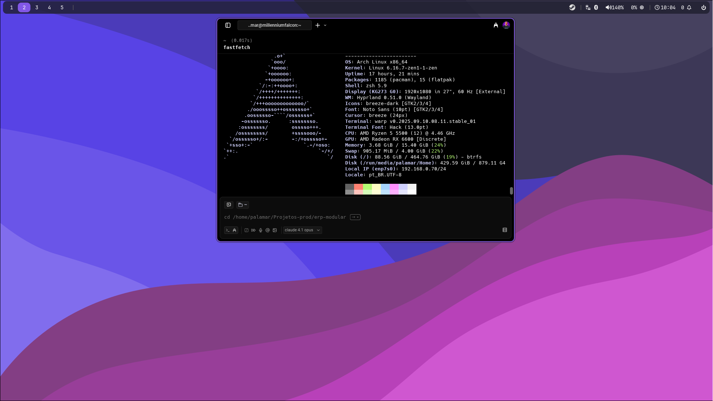

# Dotfiles para Arch-Hyprland

Uma coleção de arquivos de configuração (dotfiles) para criar um ambiente de desktop Arch Linux minimalista, moderno e funcional com o compositor Wayland Hyprland.

Este repositório contém um script de instalação automatizado para configurar rapidamente o ambiente, incluindo Hyprland, Waybar, Rofi, Kitty e outras ferramentas essenciais.

## 🎨 Visual




## ✨ Recursos

- **Compositor Wayland:** Altamente personalizável e com animações fluidas usando [Hyprland](https://hyprland.org/).
- **Barra de Status:** Uma barra moderna e informativa com [Waybar](https://github.com/Alexays/Waybar).
- **Lançador de Aplicativos:** Lançador de aplicativos e seletor de janelas com [Rofi](https://github.com/davatorium/rofi).
- **Terminal:** [Kitty](https://sw.kovidgoyal.net/kitty/), um terminal rápido e rico em recursos, acelerado por GPU.
- **Gerenciamento de Papel de Parede:** Script para selecionar e aplicar papéis de parede com [Wallust](https.github.com/dylanaraps/wallust), que gera esquemas de cores dinamicamente.
- **Notificações:** Gerenciamento de notificações com [SwayNC](https://github.com/ErikReider/SwayNotificationCenter).
- **Script de Instalação:** Um script `install.sh` para automatizar todo o processo de backup, instalação de pacotes e cópia de configurações.

## 🚀 Instalação

A instalação é gerenciada por um único script que cuida de tudo.

### Pré-requisitos

1.  **Sistema Operacional:** Uma instalação limpa do Arch Linux.
2.  **AUR Helper:** É necessário ter um AUR helper como `yay` ou `paru` instalado.

    ```bash
    # Exemplo de instalação do yay
    sudo pacman -S --needed git base-devel
    git clone https://aur.archlinux.org/yay.git
    cd yay
    makepkg -si
    ```

### Passos para Instalação

1.  **Clone o repositório:**

    ```bash
    git clone https://github.com/seu-usuario/Arch-Hyprland.git
    cd Arch-Hyprland
    ```

    _(Lembre-se de substituir `seu-usuario` pelo seu nome de usuário do GitHub)_

2.  **Execute o script de instalação:**

    O script fará um backup de suas configurações existentes (`~/.config/hypr`, `~/.config/rofi`, `~/.config/waybar`) para um diretório de backup, instalará todos os pacotes necessários (dos repositórios oficiais e do AUR) e copiará os novos dotfiles.

    ```bash
    bash install.sh
    ```

3.  **Reinicie o sistema:**

    Após a conclusão do script, é altamente recomendável reiniciar o sistema para garantir que todas as alterações sejam aplicadas corretamente.

    ```bash
    reboot
    ```

## ⌨️ Atalhos de Teclado Principais

A tecla `Super` (ou tecla do Windows) é definida como `$mainMod`.

| Atalho                  | Ação                                                 |
| ----------------------- | ---------------------------------------------------- |
| `Super + Return`        | Abrir o terminal (Kitty)                             |
| `Super + Q`             | Fechar a janela ativa                                |
| `Super + D`             | Abrir o menu de aplicativos (Rofi)                   |
| `Super + E`             | Abrir o gerenciador de arquivos (Dolphin)            |
| `Super + V`             | Alternar modo flutuante da janela                    |
| `Super + W`             | Mudar o papel de parede (script)                     |
| `Super + Setas`         | Mover o foco entre as janelas                        |
| `Super + [0-9]`         | Mudar para a área de trabalho `[0-9]`                |
| `Super + Shift + [0-9]` | Mover a janela ativa para a área de trabalho `[0-g]` |
| `Ctrl + Alt + L`        | Bloquear a tela                                      |
| `Ctrl + Alt + P`        | Menu de desligamento (Wlogout)                       |
| `Super + Ctrl + S`      | Tirar screenshot de uma área selecionada             |

## 📂 Estrutura do Projeto

- `hypr/`: Contém todas as configurações do Hyprland, incluindo atalhos, regras de janelas, monitores e aplicativos de inicialização.
- `rofi/`: Configurações de tema e aparência para o Rofi.
- `waybar/`: Arquivos de configuração e estilo (`CSS`) para a Waybar.
- `wallpaper/`: Coleção de papéis de parede usados pelo ambiente.
- `install.sh`: O script principal de automação da instalação.

## 📄 Licença

Este projeto é de código aberto. Sinta-se à vontade para usar, modificar e distribuir conforme desejar.

---
