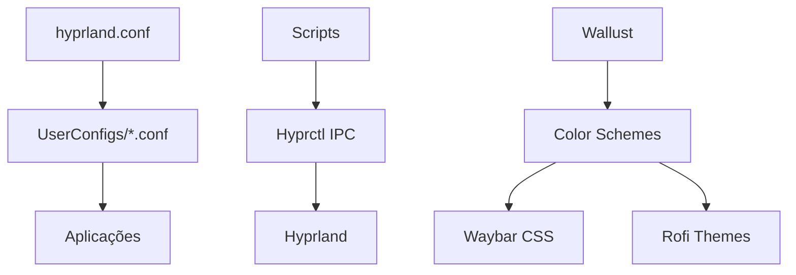

# 🏗️ Guia de Arquitetura - Arch-Hyprland

Este documento detalha a arquitetura atual do projeto e propostas de melhorias estruturais.

## 📊 Arquitetura Atual

### Visão Geral do Sistema

```
┌─────────────────────────────────────────────────────────────┐
│                    Hyprland Desktop Environment              │
├─────────────────────────────────────────────────────────────┤
│  ┌─────────────┐  ┌─────────────┐  ┌─────────────┐         │
│  │   Waybar    │  │    Rofi     │  │   Scripts   │         │
│  │  (Status)   │  │ (Launcher)  │  │ (Automation)│         │
│  └─────────────┘  └─────────────┘  └─────────────┘         │
├─────────────────────────────────────────────────────────────┤
│  ┌─────────────┐  ┌─────────────┐  ┌─────────────┐         │
│  │ Hyprpaper   │  │   SwayNC    │  │    Kitty    │         │
│  │(Wallpaper)  │  │(Notifications)│ │ (Terminal)  │         │
│  └─────────────┘  └─────────────┘  └─────────────┘         │
├─────────────────────────────────────────────────────────────┤
│                   Hyprland Compositor                        │
├─────────────────────────────────────────────────────────────┤
│                      Wayland Protocol                       │
├─────────────────────────────────────────────────────────────┤
│                        Linux Kernel                         │
└─────────────────────────────────────────────────────────────┘
```

### Fluxo de Configuração Atual



## 🔧 Problemas Identificados na Arquitetura Atual

### 1. Acoplamento Forte

- **Problema:** Componentes muito dependentes uns dos outros
- **Impacto:** Dificulta manutenção e testes
- **Exemplo:** Scripts do Waybar dependem diretamente de estrutura específica de arquivos

### 2. Falta de Abstração

- **Problema:** Lógica de negócio misturada com implementação
- **Impacto:** Dificulta reutilização de código
- **Exemplo:** Lógica de seleção de wallpaper está acoplada ao Rofi

### 3. Configuração Monolítica

- **Problema:** Arquivos de configuração grandes e complexos
- **Impacto:** Dificulta personalização e debugging
- **Exemplo:** `style.css` do Waybar com 300+ linhas

### 4. Falta de Validação

- **Problema:** Nenhuma validação de configuração antes da aplicação
- **Impacto:** Erros podem quebrar todo o sistema
- **Exemplo:** Configs inválidas podem travar o Hyprland

## 🏗️ Arquitetura Proposta

### Princípios de Design

1. **Separation of Concerns**: Cada componente tem responsabilidade única
2. **Dependency Inversion**: Depender de abstrações, não de implementações
3. **Configuration as Code**: Configurações versionáveis e testáveis
4. **Fail-Safe**: Sistema deve funcionar mesmo com componentes com falha

### Nova Estrutura de Diretórios

```
Arch-Hyprland/
├── core/                    # Componentes fundamentais
│   ├── hypr/               # Configurações base do Hyprland
│   ├── validation/         # Validadores de configuração
│   └── fallback/           # Configurações de emergência
├── components/              # Componentes modulares
│   ├── waybar/             # Módulos do Waybar
│   │   ├── themes/         # Temas organizados
│   │   ├── modules/        # Módulos individuais
│   │   └── layouts/        # Layouts de barra
│   ├── rofi/               # Configurações do Rofi
│   │   ├── themes/         # Temas do Rofi
│   │   ├── modes/          # Modos customizados
│   │   └── scripts/        # Scripts específicos
│   ├── wallpaper/          # Sistema de wallpapers
│   │   ├── collections/    # Coleções organizadas
│   │   ├── generators/     # Geradores de esquema de cores
│   │   └── presets/        # Presets de configuração
│   └── notifications/      # Sistema de notificações
├── services/               # Serviços do sistema
│   ├── config-manager/     # Gerenciador de configuração
│   ├── theme-engine/       # Engine de temas
│   ├── backup-service/     # Serviço de backup
│   └── monitor-service/    # Monitoramento do sistema
├── scripts/                # Scripts organizados por função
│   ├── core/              # Scripts fundamentais
│   ├── ui/                # Scripts de interface
│   ├── system/            # Scripts de sistema
│   └── utils/             # Utilitários
├── tests/                  # Suite de testes
│   ├── unit/              # Testes unitários
│   ├── integration/       # Testes de integração
│   └── e2e/               # Testes end-to-end
├── docs/                   # Documentação
│   ├── api/               # Documentação de API
│   ├── guides/            # Guias de usuário
│   └── architecture/      # Documentação de arquitetura
└── tools/                  # Ferramentas de desenvolvimento
    ├── build/             # Scripts de build
    ├── deploy/            # Scripts de deploy
    └── maintenance/       # Ferramentas de manutenção
```

### Sistema de Configuração Modular

#### 1. Configuration Manager

```bash
# services/config-manager/config-manager.sh
#!/bin/bash

class ConfigManager {
    private config_registry=()
    private validation_rules=()

    public register_config() {
        local config_name="$1"
        local config_path="$2"
        local validator="$3"

        config_registry["$config_name"]="$config_path"
        validation_rules["$config_name"]="$validator"
    }

    public validate_all() {
        for config in "${!config_registry[@]}"; do
            if ! validate_config "$config"; then
                return 1
            fi
        done
        return 0
    }

    public apply_config() {
        local config_name="$1"

        if validate_config "$config_name"; then
            source "${config_registry[$config_name]}"
        else
            load_fallback_config "$config_name"
        fi
    }
}
```

#### 2. Theme Engine

```bash
# services/theme-engine/theme-engine.sh
#!/bin/bash

class ThemeEngine {
    private current_theme=""
    private theme_components=()

    public load_theme() {
        local theme_name="$1"
        local theme_config="themes/$theme_name/theme.conf"

        if [[ -f "$theme_config" ]]; then
            source "$theme_config"
            apply_theme_to_components
            current_theme="$theme_name"
        fi
    }

    private apply_theme_to_components() {
        for component in "${theme_components[@]}"; do
            "$component"::apply_theme "$current_theme"
        done
    }

    public register_component() {
        local component="$1"
        theme_components+=("$component")
    }
}
```

#### 3. Component Interface

```bash
# components/interface.sh
#!/bin/bash

# Interface padrão para todos os componentes
interface Component {
    public init()           # Inicializar componente
    public validate()       # Validar configuração
    public apply_theme()    # Aplicar tema
    public cleanup()        # Limpeza
    public health_check()   # Verificação de saúde
}
```

### Implementação de Componentes

#### Waybar Component

```bash
# components/waybar/waybar-component.sh
#!/bin/bash

class WaybarComponent implements Component {
    private config_path="$HOME/.config/waybar"
    private current_layout="default"
    private modules=()

    public init() {
        create_config_structure
        load_default_layout
        register_modules
    }

    public validate() {
        jsonc-validate "$config_path/config.jsonc"
        css-validate "$config_path/style.css"
    }

    public apply_theme() {
        local theme="$1"
        generate_css_from_theme "$theme"
        reload_waybar
    }

    private reload_waybar() {
        pkill waybar 2>/dev/null
        waybar &
    }

    public load_layout() {
        local layout="$1"
        cp "layouts/$layout.jsonc" "$config_path/config.jsonc"
        current_layout="$layout"
    }

    public add_module() {
        local module="$1"
        modules+=("$module")
        regenerate_config
    }
}
```

#### Wallpaper Component

```bash
# components/wallpaper/wallpaper-component.sh
#!/bin/bash

class WallpaperComponent implements Component {
    private current_wallpaper=""
    private color_scheme=""

    public init() {
        setup_wallpaper_directory
        load_default_wallpaper
    }

    public set_wallpaper() {
        local wallpaper="$1"

        if validate_wallpaper "$wallpaper"; then
            apply_wallpaper "$wallpaper"
            generate_color_scheme "$wallpaper"
            notify_theme_change
            current_wallpaper="$wallpaper"
        fi
    }

    private generate_color_scheme() {
        local wallpaper="$1"
        wallust run "$wallpaper"
        color_scheme=$(wallust export)
    }

    private notify_theme_change() {
        # Notificar outros componentes sobre mudança de esquema de cores
        ThemeEngine::broadcast_color_change "$color_scheme"
    }
}
```

### Event System

```bash
# core/event-system.sh
#!/bin/bash

class EventSystem {
    private listeners=()

    public subscribe() {
        local event="$1"
        local callback="$2"
        listeners["$event"]+="$callback "
    }

    public emit() {
        local event="$1"
        shift
        local data="$@"

        for callback in ${listeners["$event"]}; do
            "$callback" "$data"
        done
    }
}

# Exemplo de uso
EventSystem::subscribe "wallpaper_changed" "waybar_update_colors"
EventSystem::subscribe "wallpaper_changed" "rofi_update_theme"
EventSystem::subscribe "theme_changed" "save_user_preferences"
```

### Plugin System

```bash
# services/plugin-system/plugin-manager.sh
#!/bin/bash

class PluginManager {
    private plugins=()
    private plugin_hooks=()

    public load_plugin() {
        local plugin_path="$1"

        if validate_plugin "$plugin_path"; then
            source "$plugin_path"
            register_plugin_hooks "$plugin_path"
            plugins+=("$plugin_path")
        fi
    }

    public execute_hook() {
        local hook_name="$1"
        shift
        local args="$@"

        for hook in "${plugin_hooks[$hook_name][@]}"; do
            "$hook" "$args"
        done
    }

    private validate_plugin() {
        local plugin="$1"
        # Verificar assinatura, permissões, estrutura
        return 0
    }
}

# Exemplo de plugin
# plugins/weather-widget/plugin.sh
plugin_init() {
    WaybarComponent::add_module "weather"
    register_hook "before_waybar_start" "weather_fetch_data"
}

weather_fetch_data() {
    # Buscar dados do clima
    echo "Weather data fetched"
}
```

## 📊 Benefícios da Nova Arquitetura

### 1. Modularidade

- Componentes independentes
- Facilita testes unitários
- Permite desenvolvimento paralelo
- Reduz acoplamento

### 2. Extensibilidade

- Sistema de plugins
- API padronizada
- Hooks para customização
- Facilita contribuições da comunidade

### 3. Manutenibilidade

- Código organizado
- Responsabilidades claras
- Fácil debugging
- Documentação integrada

### 4. Confiabilidade

- Validação em múltiplas camadas
- Sistema de fallback
- Recovery automático
- Logs estruturados

### 5. Performance

- Carregamento sob demanda
- Cache inteligente
- Paralelização
- Otimização automática

## 🚀 Plano de Migração

### Fase 1: Preparação (2 semanas)

1. Criar estrutura de diretórios
2. Implementar sistema de eventos básico
3. Criar interfaces para componentes
4. Configurar sistema de testes

### Fase 2: Componentização (4 semanas)

1. Migrar Waybar para novo sistema
2. Migrar sistema de wallpaper
3. Migrar Rofi
4. Implementar configuration manager

### Fase 3: Serviços (3 semanas)

1. Implementar theme engine
2. Sistema de backup
3. Monitor service
4. Plugin system básico

### Fase 4: Otimização (2 semanas)

1. Otimizações de performance
2. Testes de integração
3. Documentação
4. Migration scripts

### Fase 5: Deploy (1 semana)

1. Testes finais
2. Backup completo
3. Deploy gradual
4. Monitoramento pós-deploy

## 📝 Considerações de Implementação

### Compatibilidade

- Manter compatibilidade com configurações existentes
- Migration scripts automáticos
- Fallback para sistema antigo

### Performance

- Lazy loading de componentes
- Cache de configurações processadas
- Otimização de startup

### Usabilidade

- Interface de configuração simplificada
- Wizard de migração
- Documentação interativa

### Segurança

- Validação rigorosa de inputs
- Sandbox para plugins
- Audit trail completo

---

_Esta arquitetura foi projetada para ser evolutiva e suportar o crescimento futuro do projeto mantendo simplicidade e robustez._
